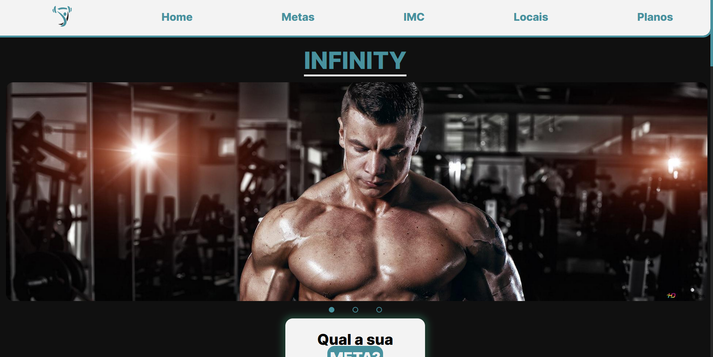

# INFINITY GYM

## Um site feito para conclusão de módulo com o tema de Academia.

Um projeto com aspecto simples focado no front-end, não conectado ao banco de dados, portanto não é um site "vivo" se resumindo a página inicial de uma academia demostrando tecnicas de desnvolvimento front.

- Site responsivo na maioria dos dispositivos
- Utilizado tecnologias de pré processamento como o **SCSS**
- Técnica de mobile-first
- Slider/Carrosel utilizando **JavaScript** puro
- Tecnologias usadas:
    - **JavaScript**
    - **SCSS**
    - **CSS 3**
    - **HTML 5**

## Design

;

## Onde acessar o site?

Você poderá acessar o site neste link [Site](lucasbonato.github.io) ou acessar pelo dominio: lucasbonato.github.io.

## Equipe

- **Lucas Bonato**: Desenvolvedor e Web Desinger
- **Lucas Rocha**: Designer e Social Manager
- **Nata**: Designer e WebMaster